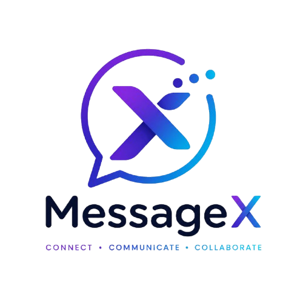
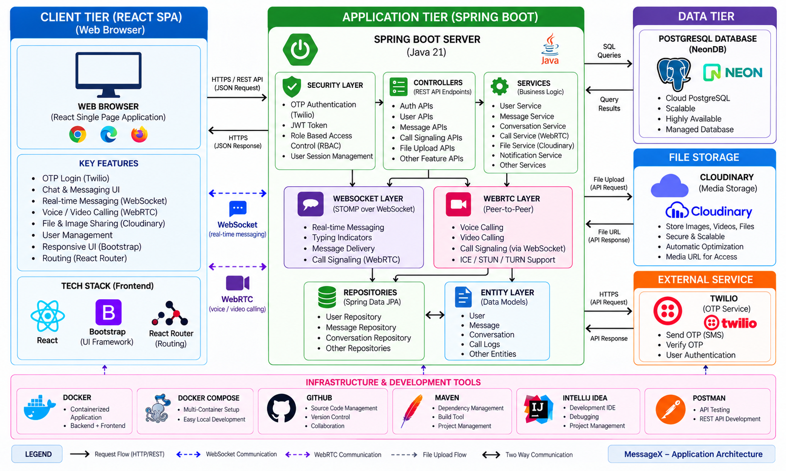

<table>
  <tr>
    <td width="220" align="center">
      
    </td>
    <td>
      <h1>MessageX - Real-Time Messaging Application</h1>
    </td>
  </tr>
</table>

<p align="center">
  A Full Stack Real-Time Messaging Platform built using Spring Boot, React, WebSocket, WebRTC, PostgreSQL, and Cloudinary.
</p>

<hr>

---

# 📖 Project Overview

MessageX is a full-stack real-time messaging application that enables users to communicate through one-to-one and group conversations with real-time message delivery.

The platform provides OTP-based authentication using Twilio, JWT-based security, role-based access control, real-time messaging through STOMP over WebSocket, one-to-one voice and video calling using WebRTC, media/file sharing through Cloudinary, user profile management, status updates, group management, notifications, and call history.

---

# 🛠️ Tech Stack

## 🎨 Frontend

<p>
  
  
  
  
  
</p>

* HTML5
* CSS3
* JavaScript (ES6+)
* React.js
* Vite
* Bootstrap 5
* React Router
* STOMP.js
* WebSocket
* WebRTC
* Fetch API
* React Icons
* Emoji Picker

---

## ⚙️ Backend

<p>
  
  
  
  
</p>

* Java 21
* Spring Boot
* Spring Security
* JWT Authentication
* OTP Authentication
* Twilio OTP Service
* Spring Data JPA
* Hibernate ORM
* REST APIs
* WebSocket
* STOMP
* WebRTC Signaling
* Cloudinary Integration
* Maven

---

## 🗄️ Database

<p>
  
</p>

* NeonDB
* PostgreSQL
* Spring Data JPA
* Hibernate ORM
* Relational Data Storage

---

## ☁️ Cloud Storage

<p>
  
</p>

* Cloudinary
* Image Uploads
* Video Uploads
* Document/File Uploads
* Profile Picture Storage
* Status Media Storage

---

## 📱 OTP Authentication

<p>
  
</p>

* Twilio
* OTP Generation and Delivery
* SMS Verification
* OTP Expiration
* Phone-Based Authentication

---

## 🐳 DevOps & Tools

<p>
  
  
  
  
</p>

* Docker
* Docker Compose
* Git
* GitHub
* Maven
* IntelliJ IDEA
* Visual Studio Code
* Postman

---


# 🏗️ System Architecture

<p align="center">
  
</p>

### 🔄 Architecture Overview

MessageX follows a layered full-stack architecture with a React client, Spring Boot application server, NeonDB PostgreSQL database, Cloudinary media storage, and Twilio OTP service.

### 🖥️ Client Layer

* React Single Page Application (SPA)
* Web Browser
* Bootstrap-based responsive UI
* React Router
* REST API communication
* STOMP over WebSocket
* WebRTC voice and video calling
* User and group messaging
* File and image sharing

### ⚙️ Application Layer

* Spring Boot REST APIs
* Spring Security
* JWT Authentication
* OTP Authentication using Twilio
* Role-Based Access Control
* Controller Layer
* Service Layer
* Repository Layer
* Entity Layer
* DTO-based data transfer
* WebSocket messaging
* WebRTC call signaling
* Cloudinary file upload integration

### 🗄️ Data Layer

* NeonDB PostgreSQL
* Spring Data JPA
* Hibernate ORM
* User data
* Messages
* Chat rooms
* Participants
* Status data
* Call records

### ☁️ External Services

* Twilio — OTP/SMS authentication
* Cloudinary — image, video, and file storage

---

# ✨ Features

## 👤 User Features

### 🔐 Authentication & Authorization

* OTP-based login
* Twilio SMS OTP verification
* JWT Authentication
* Secure session handling
* Role-Based Access Control
* Protected REST APIs

### 💬 Messaging

* One-to-one messaging
* Group messaging
* Real-time message delivery
* STOMP over WebSocket
* Text messages
* Emoji support
* Message timestamps
* Message history
* File and media sharing

### 📎 File & Media Sharing

* Upload images
* Upload videos
* Upload documents
* Cloudinary-based media storage
* Profile picture upload
* Status media upload

### 👥 Group Management

* Create groups
* Add members
* Remove members
* Leave groups
* Delete groups
* Group administration
* Group participant management

### 📞 Voice & Video Calling

* One-to-one voice calls
* One-to-one video calls
* WebRTC peer-to-peer communication
* WebSocket-based call signaling
* ICE candidate exchange
* STUN support
* Call records/history

### 🟢 Status

* Create status updates
* Image status
* Video status
* View statuses
* Status viewers
* Delete own status
* Cloudinary media storage

### 👤 Profile Management

* View profile
* Update username
* Update About information
* Change profile picture
* Cloudinary profile image storage

### 🔔 Notifications

* Real-time notifications
* Message notifications
* Call-related notifications
* Status-related updates

---

# 🔐 Security Features

* Spring Security
* JWT Authentication
* OTP Authentication using Twilio
* Role-Based Authorization
* Protected REST Endpoints
* JWT validation
* Secure WebSocket authentication
* WebSocket STOMP authorization
* Input validation
* Global exception handling
* Environment-variable based secret configuration
* Protected Cloudinary upload APIs

---

# ⚡ Real-Time Communication

## WebSocket

MessageX uses STOMP over WebSocket for real-time communication between the React frontend and Spring Boot backend.

Used for:

* Real-time messages
* Group messages
* Typing indicators
* Real-time notifications
* Call signaling

## WebRTC

WebRTC provides peer-to-peer media communication for one-to-one calls.

Used for:

* Voice calls
* Video calls
* Audio/video streams
* ICE candidate exchange
* Peer connection management

The Spring Boot server handles signaling, while the actual audio/video media is exchanged peer-to-peer through WebRTC.

---

# 📂 Project Structure

```text
MessageX
│
├── messageX_Backend
│   ├── src
│   │   ├── main
│   │   │   ├── java/com/messageX
│   │   │   │   ├── Config
│   │   │   │   ├── Controller
│   │   │   │   │   └── Dtos
│   │   │   │   ├── Entity
│   │   │   │   ├── Repository
│   │   │   │   ├── Service
│   │   │   │   └── MessageXApplication.java
│   │   │   └── resources
│   │   │       └── application.properties
│   │   └── test
│   │
│   ├── Dockerfile
│   ├── pom.xml
│   ├── mvnw
│   └── mvnw.cmd
│
├── messageX_frontend
│   ├── src
│   │   ├── api
│   │   ├── components
│   │   │   ├── ChatList
│   │   │   ├── ChatWindow
│   │   │   ├── Footer
│   │   │   ├── NewChatModal
│   │   │   └── Sidebar
│   │   ├── Pages
│   │   │   ├── Auth
│   │   │   ├── Calls
│   │   │   ├── Chat
│   │   │   ├── Groups
│   │   │   ├── Landing
│   │   │   ├── Profile
│   │   │   └── Status
│   │   ├── assets
│   │   ├── App.jsx
│   │   └── main.jsx
│   ├── Dockerfile
│   ├── index.html
│   ├── package.json
│   ├── package-lock.json
│   └── vite.config.js
│
├── docker-compose.yml
└── README.md
